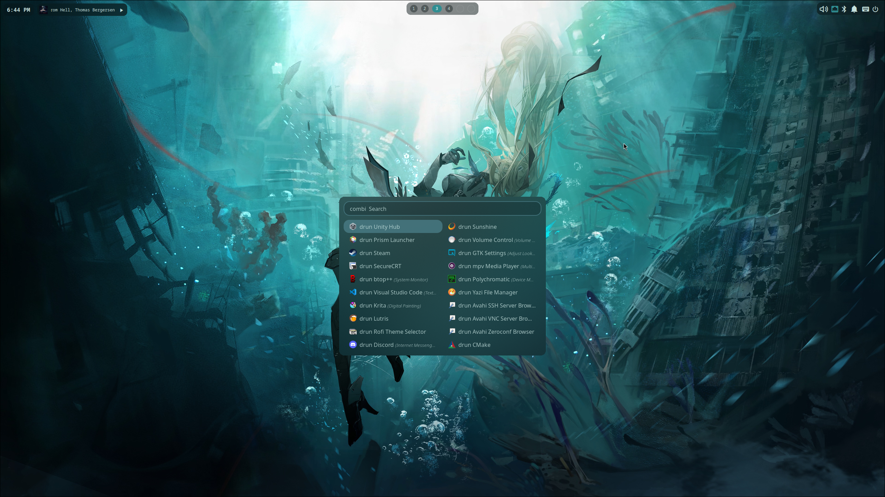
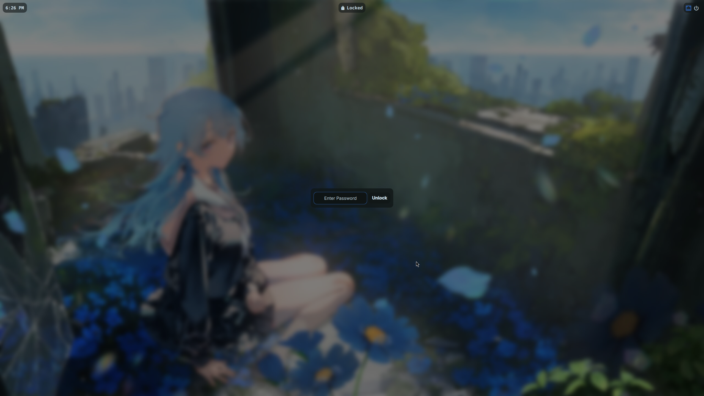

# nrszero's Dotfiles Arch-Hyprland

Arch Linux + Hyprland configuration files.

Managed with GNU Stow.

## Features

- **Hyprland** built with new Lua configuration and per-monitor workspaces.
- **Quickshell** QML-based UI (Status Bar, Login Screen, and Lock Screen).
- **Wallpaper Slideshow** with custom keybinds using awww.
- **Display Manager** using greetd with Hyprland integration.
- **Hardware Detection** detects Intel or AMD CPUs to install Vulkan drivers, and configures NVIDIA GPUs.
- **Neovim** Lua-based editor configuration with LSP and plugins.
- **Simple Installation** just run the install.sh. 

## Video

<video src="https://github.com/user-attachments/assets/a66a44c0-04b9-4aa5-84fc-1c2b23b1d1fe" width="100%" controls>
  Your browser does not support the video tag.
</video>

## Screenshots

|                                 Status Bar & Blurred Windows                                  |                                       Rofi App Launcher                                       |
| :-------------------------------------------------------------------------------------------: | :-------------------------------------------------------------------------------------------: |
|  |  |
|                                    **Popup Menu Buttons**                                     |                                    **Minimal Lockscreen**                                     |
|  |  |

## 📦 Installation

### System Requirements

- **OS**: Arch Linux
- **Display Server**: Wayland
- **Shell**: Bash

### Prerequisites

Install `git`, `stow`, `yay or paru`:

<details>
<summary><b>Click to expand: Yay & Paru Installation Instructions</b></summary>

```bash
# Install yay instructions
sudo pacman -S --needed git base-devel
cd ~/ && git clone https://aur.archlinux.org/yay.git
cd yay
makepkg -si

# Install paru instructions
sudo pacman -S --needed base-devel git
cd ~/ && git clone https://aur.archlinux.org/paru.git
cd paru
makepkg -si
```
</details>

```bash
sudo pacman -S --needed --noconfirm git stow
```

### Quick Install

```bash
git clone https://github.com/nrszero/dotfiles-arch-hyprland.git ~/dotfiles
cd ~/dotfiles
chmod +x ~/dotfiles/install.sh
./install.sh
```

When prompted, **choose option 1** to install all required packages.

### Post-Installation Configuration

**Important**: You may need to adjust your monitor configuration before first login.

Edit this file to match your display setup:
- `/etc/greetd/monitors.lua` - Global monitor configuration
- Then run `hyprctl reload` to apply

If you change files in ~/dotfiles/etc run install.sh again:
```bash
# Option 1: Skip package installation
SKIP_PACKAGES=1 ./install.sh

# Option 2: Run installer again and choose option 3
./install.sh  # then select "3) Skip packages, only deploy configs"
```

### What the Install Script Does

- Installs all required packages.
- Safely backs up any ~/.config files to a timestamped ~/.config.bak/ directory.
- Detects Intel or AMD CPUs to dynamically install the correct Vulkan drivers.
- Auto-detects NVIDIA GPU and configures accordingly.
- Scans for Bluetooth hardware and automatically enables bluetooth.service if found.
- Symlinks configurations to `~/.config` using stow.
- Deploys system-wide configs to `/etc` (requires sudo).
- Installs wallpapers to `/usr/share/wallpapers`.

### Troubleshooting

**Greetd login screen not loading**
- Check monitor configuration in the post-install step above.
- Verify greetd service is enabled: `sudo systemctl enable greetd`.

## ⚙️ Configuration Highlights

### Hyprland (~/.config/hypr/)
- Built with new Lua configuration.
- Custom per-monitor workspace keybinds.
- Sleep and Screen Lock support.
- Minimal animations and wallpaper-responsive terminal colors.
- NVIDIA-specific optimizations.

### Terminal & CLI Workflow
- Terminal tools like yazi for file management, zoxide for smart directory navigation, fzf, and ripgrep.

### Neovim (~/.config/nvim/)
- Plugin management with lazy.nvim.
- Includes Telescope for fuzzy finding and Oil.nvim for directory navigation.
- Has LSP configuration with custom keymaps.

### Quickshell (~/.config/quickshell/)
- Implements the Wayland session lock protocol for a secure and custom lock screen.
- Media and audio controls are integrated into Quickshell UI utilizing pipewire, wireplumber, and mpv-mpris
- Dedicated widgets for controlling Media, Audio, Networks, Bluetooth, and Notifications.
- Keybind `SUPER + Tab` to Auto-hide the UI.
