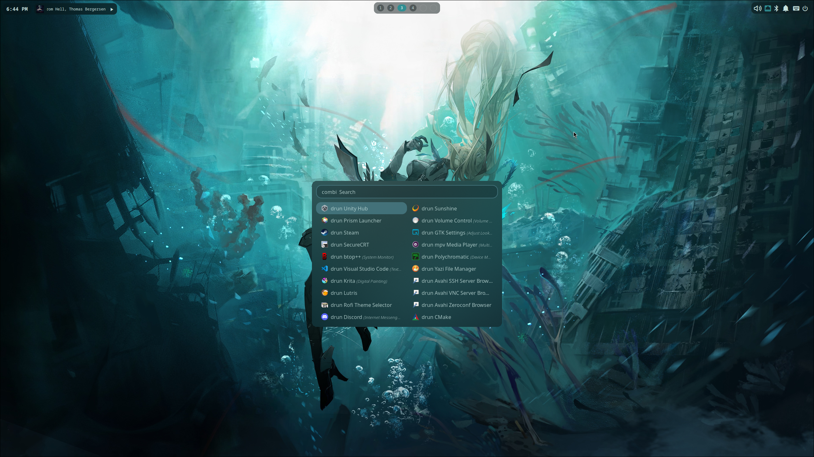
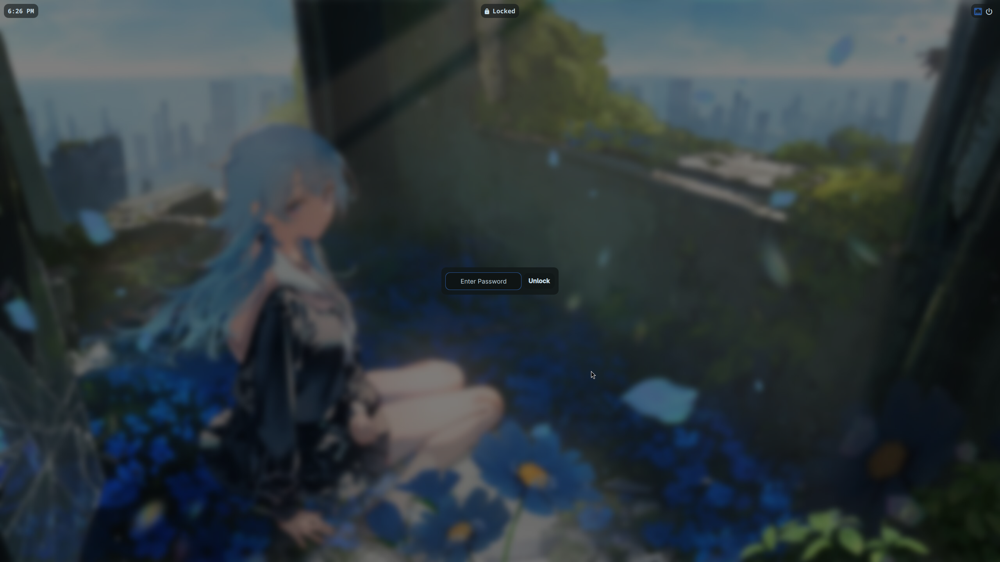

# nrszero's Dotfiles Arch-Hyprland

Arch Linux + Hyprland configuration files.

User configs in `~/.config` are symlinked with GNU Stow. System files under `/etc` are copied by `install.sh`.

## Features

- **Hyprland** built with new Lua configuration and per-monitor workspaces.
- **Quickshell** QML-based UI (Status Bar, Login Screen, Lock Screen, and Workspace Preview).
- **Wallpaper Slideshow** with custom keybinds using awww.
- **Display Manager** using greetd with Hyprland integration.
- **Hardware Detection** installs drivers for every detected Intel, AMD, or supported NVIDIA GPU.
- **Neovim** Lua-based editor configuration with LSP and plugins.
- **Simple Installation** just run the install.sh. 

## Video

<video src="https://github.com/user-attachments/assets/a66a44c0-04b9-4aa5-84fc-1c2b23b1d1fe" width="100%" controls>
  Your browser does not support the video tag.
</video>

## Screenshots

|                                 Status Bar & Blurred Windows                                  |                                       Rofi App Launcher                                       |
| :-------------------------------------------------------------------------------------------: | :-------------------------------------------------------------------------------------------: |
|  |  |
|                                    **Popup Menu Buttons**                                     |                                    **Minimal Lockscreen**                                     |
|  |  |

## 📦 Installation

### System Requirements

- **OS**: Arch Linux
- **Display Server**: Wayland
- **Shell**: Bash

### Prerequisites

Install `git`, `stow`, `yay or paru`:

<details>
<summary><b>Click to expand: Yay & Paru Installation Instructions</b></summary>

```bash
# Install yay instructions
sudo pacman -S --needed git base-devel
cd ~/ && git clone https://aur.archlinux.org/yay.git
cd yay
makepkg -si

# Install paru instructions
sudo pacman -S --needed base-devel git
cd ~/ && git clone https://aur.archlinux.org/paru.git
cd paru
makepkg -si
```
</details>

```bash
sudo pacman -S --needed --noconfirm git stow
```

### Quick Install

```bash
git clone https://github.com/nrszero/dotfiles-arch-hyprland.git ~/dotfiles
cd ~/dotfiles
chmod +x ~/dotfiles/install.sh
./install.sh
```

When prompted, **choose option 1** to install all required packages.

### Post-Installation Configuration

**Important**: You may need to adjust your monitor configuration before first login.

Arrange displays in Lumen after login (`SUPER + SPACE` → **Display**), or edit the system file:
- `/etc/greetd/monitors.lua` — global monitor layout (not overwritten by git updates)
- Then run `hyprctl reload` if you edited the file by hand

If you change files in ~/dotfiles/etc run install.sh again:
```bash
# Option 1: Skip package installation
SKIP_PACKAGES=1 ./install.sh

# Option 2: Run installer again and choose option 3
./install.sh  # then select "3) Skip packages, only deploy configs"
```

### What the Install Script Does

- Installs all required packages.
- Safely backs up any ~/.config files to a timestamped ~/.config.bak/ directory.
- Detects PCI display controllers and installs each vendor's Vulkan driver stack, including hybrid systems.
- Automatically configures NVIDIA's open kernel modules only for device IDs in the pinned NVIDIA compatibility list.
- Stops before NVIDIA-specific changes on older or unknown GPUs so the appropriate proprietary or legacy driver can be selected manually.
- Scans for Bluetooth hardware and automatically enables bluetooth.service if found.
- Symlinks `~/.config` with Stow.
- Copies system configs to `/etc` with rsync (requires sudo).
- Installs wallpapers to `/usr/share/wallpapers`.

### Troubleshooting

**Greetd login screen not loading**
- Arrange monitors in Lumen (`SUPER + SPACE` → Display) or edit `/etc/greetd/monitors.lua` as in the post-install step above.
- Verify greetd service is enabled: `sudo systemctl enable greetd`.

**NVIDIA GPU requires manual driver selection**
- Note the `10de:xxxx` PCI ID printed by the installer.
- Check that ID against NVIDIA's supported-GPU documentation and install the appropriate proprietary or legacy driver.
- The installer intentionally does not guess a legacy AUR package branch.

**NVIDIA boot parameter backend**
- The installer updates every usable GRUB and mkinitcpio UKI configuration it detects.
- If both are configured, both are updated without prompting so fallback entries remain consistent.
- If no usable backend can be identified, no boot configuration is changed.

## ⚙️ Configuration Highlights

### Hyprland (~/.config/hypr/)
- Built with new Lua configuration.
- Custom per-monitor workspace keybinds.
- Sleep and Screen Lock support.
- Minimal animations and wallpaper-responsive terminal colors.
- NVIDIA-specific optimizations.

### Terminal & CLI Workflow
- Terminal tools like yazi for file management, zoxide for smart directory navigation, fzf, and ripgrep.

### Neovim (~/.config/nvim/)
- Plugin management with lazy.nvim.
- Includes Telescope for fuzzy finding and Oil.nvim for directory navigation.
- Has LSP configuration with custom keymaps.

### Quickshell (~/.config/quickshell/)
- Implements the Wayland session lock protocol for a secure and custom lock screen.
- Media and audio controls are integrated into Quickshell UI utilizing pipewire, wireplumber, and mpv-mpris
- Dedicated widgets for controlling Media, Audio, Networks, Bluetooth, and Notifications.
- Keybind `SUPER + B` to auto-hide the status bar.
- Keybind `SUPER + Tab` to preview workspaces.
